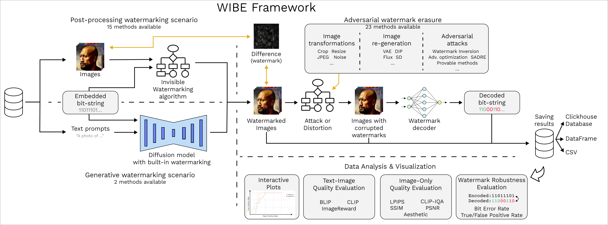
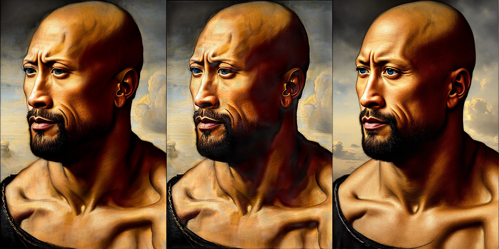
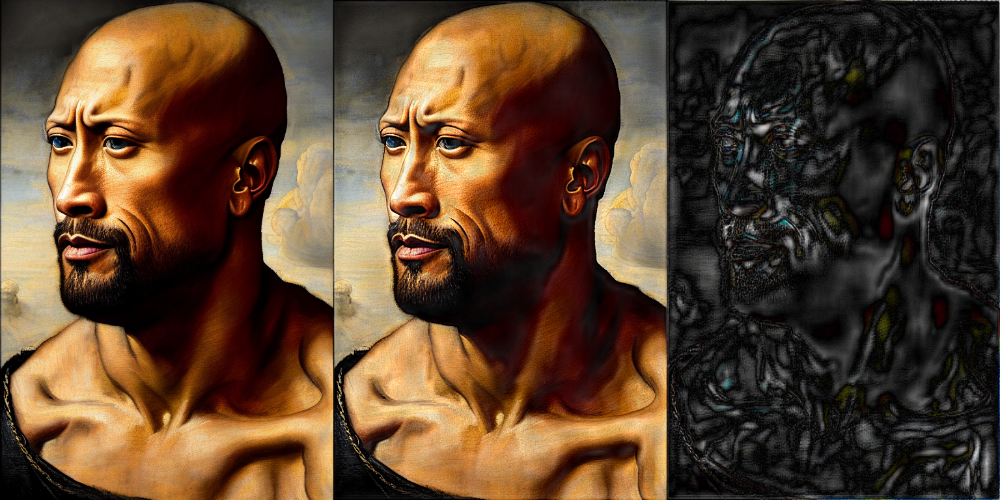
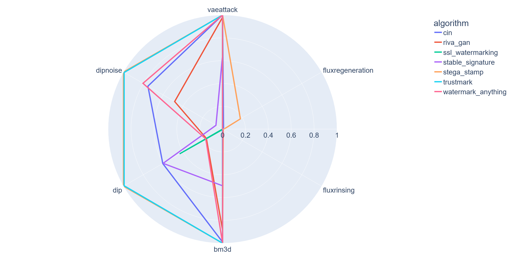

# [ASE 2025 Tool Demo] WIBE: Watermarks for generated Images – Benchmarking & Evaluation
# (Coming soon) WARP: A Unified Benchmark for Invisible Image Watermarking — Robustness and Protection Against Attacks


**WIBE** is a modular and extensible framework for automated testing of invisible image and audio watermarking methods under various attack scenarios.
The system is designed to support research and development of robust watermarking techniques by enabling systematic evaluation
through a customizable processing pipeline.

The system architecture consists of a sequence of processing configurable stages.



## Key features

* Modularity and extensibility through a plugin-based architecture
* Reproducibility ensured by YAML-configured experiments
* Usability with a simple command-line interface
* Flexible persistence through multiple storage backends, including files and ClickHouse database
* Transparency via real-time visual feedback
* Scalability to run experiments on clusters

## Implemented algorithms, attacks, datasets and metrics

<details>
<summary><b>Algorithms</b></summary>

### Image domain

| Algorithm | Type | Config name | Default capacity | Reference |
|-----------|------|-------------|------------------|-----------|
| ARWGAN | post-hoc | arwgan | 30 bits | [ARWGAN: Attention-Guided Robust Image Watermarking Model Based on GAN](https://ieeexplore.ieee.org/document/10155247) |
| CIN | post-hoc | cin | 30 bits | [Towards Blind Watermarking: Combining Invertible and Non-invertible Mechanisms](https://arxiv.org/abs/2212.12678) |
| DCT Marker | post-hoc | dct_marker | 1 - 800 bits | [Real data performance evaluation of CAISS watermarking scheme](https://link.springer.com/article/10.1007/s11042-013-1544-3) |
| DFT Circle | post-hoc | dft_circle | zero-bit | [Discrete Fourier transform-based watermarking method with an optimal implementation radius](https://doi.org/10.1117/1.3609010) |
| DWSF | post-hoc | dwsf | 30 bits | [Practical Deep Dispersed Watermarking with Synchronization and Fusion - Image Watermarking Algorithm](https://github.com/bytedance/DWSF) |
| DWT SVM | post-hoc | dwt_svm | 512 bits | [SVM-based robust image watermarking technique in LWT domain using different sub-bands](https://doi.org/10.1007/s00521-018-3647-2) |
| DWT DCT | post-hoc | dwt_dct | 100 bits | [frequency-domain transforms: DWT + DCT](https://github.com/ShieldMnt/invisible-watermark) |
| DWT DCT SVD | post-hoc | dwt_dct_svd | 100 bits | [frequency-domain with additional SVD processing](https://github.com/ShieldMnt/invisible-watermark) |
| HiDDeN | post-hoc | hidden | 30 bits | [HiDDeN: Hiding Data in Deep Networks --- Image Watermarking Algorithm](https://github.com/ando-khachatryan/HiDDeN) |
| InvisMark | post-hoc | invismark | 100 bits | [Invisible and Robust Watermarking for AI-generated Image Provenance](https://github.com/microsoft/InvisMark) |
| MBRS | post-hoc | mbrs | 30/256 bits | [Enhancing Robustness of DNN-based Watermarking by Mini-Batch of Real and Simulated JPEG Compression](https://github.com/jzyustc/MBRS) |
| SS HiDDeN | post-hoc | sshidden | 48 bits | HiDDeN watermarking algorithm adapted from the [Stable Signature](https://github.com/facebookresearch/stable_signature/tree/main) |
| RivaGAN | post-hoc | riva_gan | 30 bits | [Image watermarking via RivaGAN: a deep-learning-based encoder/decoder with attention mechanism](https://github.com/ShieldMnt/invisible-watermark) |
| SSL | post-hoc | ssl_watermarking | zero-bit / 32 bits | [Watermarking Images in Self-Supervised Latent-Spaces (SSL)](https://github.com/facebookresearch/ssl_watermarking) |
| Stable Signature | built-in | stable_signature | 48 bits (fixed for single model) | [The Stable Signature: Rooting Watermarks in Latent Diffusion Models](https://github.com/facebookresearch/stable_signature/tree/main) |
| StegaStamp | post-hoc | stega_stamp | 100 bits | [StegaStamp: Invisible Hyperlinks in Physical Photographs](https://github.com/tancik/StegaStamp) |
| TreeRing | built-in | treering | zero-bit | [Tree-Ring: Fingerprints for Diffusion Images that are Invisible and Robust](https://github.com/YuxinWenRick/tree-ring-watermark) |
| TrustMark | post-hoc | trustmark | 100 bits | [TrustMark: Universal Watermarking for Arbitrary Resolution Images](https://github.com/adobe/trustmark) |
| VideoSeal | post-hoc | videoseal | 256 bits | [Video Seal: Open and Efficient Video Watermarking](https://github.com/facebookresearch/videoseal) |
| PixelSeal | post-hoc | pixelseal | 256 bits | [Pixel Seal: Adversarial-only training for invisible image and video watermarking](https://github.com/facebookresearch/videoseal) |
| ChunkySeal | post-hoc | chunkyseal | 1024 bits | [We Can Hide More Bits: The Unused Watermarking Capacity in Theory and in Practice](https://github.com/facebookresearch/videoseal) |
| Watermark Anything | post-hoc | watermark_anything | 32 bits | [Watermark Anything with Localized Messages - Image Watermarking Algorithm](https://github.com/facebookresearch/watermark-anything) |
| MaskWM | post-hoc | maskwm | 32/64/128 bits | [Mask Image Watermarking](https://github.com/hurunyi/MaskWM) |
| SyncSeal | post-hoc | syncseal | method-dependent | [GEOMETRIC IMAGE SYNCHRONIZATION WITH DEEP WATERMARKING](https://github.com/facebookresearch/wmar/tree/main/syncseal) |
| Gaussian Shading | built-in | gaussian_shading | 256 bits | [Gaussian Shading: Provable Performance-Lossless Image Watermarking for Diffusion Models](https://github.com/bsmhmmlf/Gaussian-Shading) |
| Ring-ID | built-in | ringid | zero-bit | [RingID: Rethinking Tree-Ring Watermarking for Enhanced Multi-Key Identification - Image Watermarking Algorithm](https://github.com/showlab/RingID) |
| MaXsive | built-in | maxsive | zero-bit | [MaXsive: High-Capacity and Robust Training-Free Generative Image Watermarking in Diffusion Models](https://github.com/Mao718/MaXsive) |
| METR | built-in | metr | 10 bits | [METR: Image Watermarking with Large Number of Unique Messages](https://github.com/deepvk/metr) |
| PIMoG | post-hoc | pimog | 30 bits | [PIMoG: An Effective Screen-shooting Noise-Layer Simulation for Deep-Learning-Based Watermarking Network](https://github.com/FangHanNUS/PIMoG-An-Effective-Screen-shooting-Noise-Layer-Simulation-for-Deep-Learning-Based-Watermarking-Netw) |
| Robust-Wide | post-hoc | robust_wide | 64 bits | [Robust-Wide: Robust Watermarking Against Instruction-Driven Image Editing](https://github.com/hurunyi/Robust-Wide) |
| FIN | post-hoc | fin | 64 bits | [FIN: Flow-Based Robust Watermarking with Invertible Noise Layer for Black-Box Distortions](https://github.com/QQiuyp/FIN) |
| VINE | post-hoc | vine | 100 bits | [Robust Watermarking Using Generative Priors Against Image Editing: From Benchmarking to Advances](https://github.com/Shilin-LU/VINE) |
| SepMark | post-hoc | sepmark | 30/128 bits | [SepMark: Deep Separable Watermarking for Unified Source Tracing and Deepfake Detection](https://github.com/sh1newu/SepMark) |
| RoSteALS | post-hoc | rosteals | 100 bits | [RoSteALS: Robust Steganography using Autoencoder Latent Space](https://github.com/TuBui/RoSteALS) |

### Audio domain

| Algorithm                     | Type     | Config name                                  | Default capacity         | Reference                                                                                                                                                                                            |
|-------------------------------|----------|----------------------------------------------|--------------------------|------------------------------------------------------------------------------------------------------------------------------------------------------------------------------------------------------|
| AudioSeal                     | post-hoc | audioseal                                    | 16 bits                  | [AudioSeal: Efficient Localized Audio Watermarking](https://github.com/facebookresearch/audioseal)                                                                                                   |
| SilentCipher                  | post-hoc | silent_cipher                                | 40 bits                  | [SilentCipher: Deep Audio Watermarking](https://github.com/sony/silentcipher)                                                                                                                        |
| WavMark                       | post-hoc | wavmark                                      | 16 bits                  | [WavMark: Watermarking for Audio Generation](https://github.com/sony/silentcipher)                                                                                                                   |
| AWARE                         | post-hoc | aware                                        | 20 bits                  | [AWARE: Audio Watermarking via Adversarial Resistance to Edits](https://github.com/deepmark/aware)                                                                                                   |
| RobustDNN                     | post-hoc | dnn_audio                                    | 512 bits (6 keys)        | [Robust speech watermarking by a jointly trained embedder and detector using a DNN](https://github.com/kosta-pmf/dnn-audio-watermarking)                                                             |
| HIFI-Mark                     | post-hoc | hifimark                                    | 256 bits                  | [High-capacity Imperceptible Fidelity-preserving Information Watermarking](https://gitlab.ispras.ru/watermarking/dnn-audio-reworked)                                                             |
| Perth                         | post-hoc | perth                                        | zero-bit                 | [Perth: Open Source AI Watermarking Model](https://github.com/resemble-ai/perth)                                                                                                                     |
| CryptoMark                    | post-hoc | cryptomark                                   | 256 bits                 | [CryptoMark: Cryptographically Enforced and Perceptually Invisible Audio Watermarking](https://gitlab.ispras.ru/watermarking/dm-audio)                                                               |
| FSVC                          | post-hoc | fsvc                                         | 40 bits (default params) | [Desynchronization Attacks Resilient Watermarking Method Based on Frequency Singular Value Coefficient Modification](https://github.com/kosta-pmf/audio-watermarking/blob/main/fsvc_watermarking.py) |
| Patchwork                     | post-hoc | patchwork                                    | 40 bits (default params) | [Patchwork-Based Multilayer Audio Watermarking](https://github.com/kosta-pmf/audio-watermarking/blob/main/patchwork_multylayer_watermarking.py)                                                      |
| DCT-b1                        | post-hoc | dct_b1                                       | 24 bits (default params) | [Robust, transparent and high-capacity audio watermarking in DCT domain](https://github.com/kosta-pmf/audio-watermarking/blob/main/dct_watermarking.py)                                              |
| Norm space                    | post-hoc | norm_space                                   | 40 bits (default params) | [Novel secured scheme for blind audio/speech norm-space watermarking by Arnold algorithm](https://github.com/kosta-pmf/audio-watermarking/blob/main/norm_space_watermarking.py)                      |
| Spread Spectrum               | post-hoc | spread_spectrum                              | 10 bits (default params) | [Spread-Spectrum Watermarking of Audio Signals](https://gist.github.com/tam17aki/326cf8666338e39d4f5f9cb777e8c6c0)                                                                                   |
| Quantization Index Modulation | post-hoc | qim                                          | 40 bits (default params) | [Quantization Index Modulation: A Class of Provably Good Methods for Digital Watermarking and Information Embedding](https://github.com/pl561/QuantizationIndexModulation)                           |
| Echo Hiding Watermarking      | post-hoc | echo-positive,  echo-negative,  echo-forward | 16 bits (default params) | [Echo hiding](https://github.com/ktekeli/audio-steganography-algorithms/tree/master/02-Echo-Hiding)                                                                                                  |
| Least Significant Bit         | post-hoc | lsb                                          | 40 bits (default params) | [Audio Steganography Method Using Least Significant Bit (LSB) Encoding Technique](https://github.com/shalom06/Audio-Stego)          

</details>

<details>
<summary><b>Attacks</b></summary>

### Image domain

| Attack | Config name | Description |
|--------|-------------|-------------|
| Distortions | jpeg, rotate90, rotate, gaussianblur, gaussiannoise, centercrop, resize, randomcropout, brightness, contrast, pixelshift, colorinversion | Common distortions like JPEG, blur, noise, rotation, etc |
| WPWMAttacker | wpwmattacker | [Saliency-Aware Diffusion Reconstruction for Effective Invisible Watermark Removal](https://github.com/inzamamulDU/SADRE) |
| DIP | dip | DIP-based watermark evasion attack adopted from the github [repository](https://github.com/sun-umn/DIP_Watermark_Evasion_TMLR) |
| Adversarial | adversarialembedding | Adversarial embedding attack from [WAVES](https://github.com/umd-huang-lab/WAVES) |
| Adversarial PSNR | adversarialembeddingpsnr | Modification of adversarial embedding attack that uses PSNR |
| Averaging | averaging | Attack based on simple averaging from [paper](https://arxiv.org/abs/2406.09026) |
| Blur Deblur | blurdeblurfpninception | Blur image and restore it with [DeblurGAN-v2](https://arxiv.org/abs/1908.03826) |
| DoG Blur Deblur | dogblurdeblurfpninception | DoG blur image and restore it with [DeblurGAN-v2](https://arxiv.org/abs/1908.03826) |
| BM3D | bm3d | [Block-matching and 3D filtering ](https://webpages.tuni.fi/foi/GCF-BM3D/) image denoising |
| VAE | vaeattack | Adversarial attack using a [FLUX.1-schnell VAE](https://huggingface.co/black-forest-labs/FLUX.1-schnell) to generate noisy image reconstructions |
| StegastampInversion | stegastampinversion | Adversarial attack that inverts watermarks encoded by Stegastamp |
| DiffusionRegeneration | diffusionregeneration | [Invisible Image Watermarks Are Provably Removable Using Generative AI](https://arxiv.org/abs/2306.01953) |
| FluxRegeneration | fluxregeneration | [Image regeneration attack](https://github.com/leiluk1/erasing-the-invisible-beige-box/blob/main/notebooks/treering_attack.ipynb) using FLUX image-to-image diffusion model |
| FluxRinsing | fluxrinsing | [Multi-step image purification](https://github.com/leiluk1/erasing-the-invisible-beige-box/blob/main/notebooks/treering_attack.ipynb) using repeated FLUX regeneration |
| VAERegeneration | vaeregeneration | Based on [WatermarkAttacker](https://github.com/XuandongZhao/WatermarkAttacker/blob/main/wmattacker.py#L19) |
| Frequency Masking | frequencymasking | Image-domain frequency masking attack that suppresses low-frequency components. |
| Latent Frequency Masking | latentfrequencymasking | Latent-space frequency masking attack for diffusion model representations. |
| Image Editing Flux Kontext | imageeditingfluxcontext | Adversarial attack that edits images using instruction-guided generation. ([Flux Kontext](https://huggingface.co/black-forest-labs/FLUX.1-Kontext-dev) model) |
| Image Editing InstructPix2Pix | imageeditinginstructpix2pix | Adversarial attack that edits images using instruction-guided generation. ([InstructPix2Pix](https://arxiv.org/abs/2211.09800) model) |
| LIIF | liifattack | [LIIF](https://github.com/yinboc/liif) super-resolution |
| SEMAttack | semattack | [Black-Box Forgery Attacks on Semantic Watermarks for Diffusion Models](https://github.com/and-mill/semantic-forgery) |
| WMForger | wmforger | [Transferable Black-Box One-Shot Forging of Watermarks via Image Preference Models](https://github.com/facebookresearch/videoseal/blob/main/wmforger) |
| TrustMarkRM | trustmarkrm | [TrustMark: Universal Watermarking for Arbitrary Resolution Images](https://github.com/adobe/trustmark) |
| NRP small | nrpsmall | [A Self-supervised Approach for Adversarial Robustness.](https://openaccess.thecvf.com/content_CVPR_2020/papers/Naseer_A_Self-supervised_Approach_for_Adversarial_Robustness_CVPR_2020_paper.pdf) Smaller backbone variant. |
| NRP large | nrplarge | [A Self-supervised Approach for Adversarial Robustness.](https://openaccess.thecvf.com/content_CVPR_2020/papers/Naseer_A_Self-supervised_Approach_for_Adversarial_Robustness_CVPR_2020_paper.pdf) Larger backbone variant. |
| MPRNet | mprnetattack | [Multi-stage progressive image restoration](https://arxiv.org/abs/2102.02808) |
| Uni inv attack FLUX | uniinvattackflux | Image Inversion and Reconstruction using Flux model |
| Uni edit attack FLUX | unieditattackflux | Image Editing using Flux model |
| DISCO | discoattack | [DISCO: Adversarial Defense with Local Implicit Functions](https://arxiv.org/abs/2212.05630) |
| DiffPure | diffpureattack | [Diffusion Models for Adversarial Purification](https://arxiv.org/abs/2205.07460) |
| RealESRGAN | realesrganattack | [Real-ESRGAN: Training Real-World Blind Super-Resolution with Pure Synthetic Data](https://arxiv.org/abs/2107.10833) |
| UnMarkerAttack | unmarkerattack | [UnMarker: A Universal Attack on Defensive Image Watermarking](https://arxiv.org/abs/2405.08363) |
| Instagram/CSS filters | instagramcss_filters | [Instagram/CSS filters for image editing](https://github.com/akiomik/pilgram) |

### Audio domain

| Attack             | Config name                                                                                    | Description                                                                                                                                         |
|--------------------|------------------------------------------------------------------------------------------------|-----------------------------------------------------------------------------------------------------------------------------------------------------|
| Signal distortions | signinversion, resampling, requantization, gain, filter, whitenoise, pinknoise, clipping       | Common signal-level transformations affecting amplitude, sampling, quantization, frequency content, or noise.                                       |
| Compression        | mpeg, aac, opus, encodec, dac                                                                  | Lossy conventional and neural audio compression codecs.                                                                                             |
| Acoustic           | echo, reverb                                                                                   | Acoustic effects simulating propagation and reflections of sound.                                                                                   |
| Effect             | pitchshift, dynamicrangecompressor, limiter                                                    | Different audio effects.                                                                                                                            |
| Enhancement        | wienerfilter                                                                                   | Signal enhancement and denoising methods that modify the audio to suppress noise or unwanted components.                                            |
| MetricGAN+         | metricganplus                                                                                  | Black-box speech-enhancement attack using [MetricGAN+](https://huggingface.co/speechbrain/metricgan-plus-voicebank) ([paper](https://www.isca-archive.org/interspeech_2021/fu21_interspeech.html), [implementation](https://github.com/speechbrain/speechbrain)). |
| GTCRN              | gtcrn                                                                                          | Black-box speech-enhancement attack using the official [GTCRN](https://github.com/Xiaobin-Rong/gtcrn) DNS3 checkpoint ([paper](https://ieeexplore.ieee.org/document/10448310)). |
| Desynchronization  | cut, speed, timestretch, invertedtimestretch, flipsamples, zerocrossinserts, replacementattack, framedropout | Distortions that modify the temporal structure or local alignment of the signal.                                                                    |
| Vocos              | vocos                                                                                          | [Vocos: Closing the gap between time-domain and Fourier-based neural vocoders for high-quality audio synthesis](https://github.com/gemelo-ai/vocos) |
### Common

| Attack | Config name | Description |
|--------|-------------|-------------|
| Distortions | identity | No attack applied |

</details>

<details>
<summary><b>Datasets</b></summary>


| Dataset          | Config name         | Description                                                                                                                                                                  |
|------------------|---------------------|------------------------------------------------------------------------------------------------------------------------------------------------------------------------------|
| Image folder     | imagefolderdataset  | Loading images from a directory                                                                                                                                              |
| Prompt folder    | promptfolderdataset | Loading text prompts from a directory with .txt files                                                                                                                        |
| Audio Folder     | audiofolderdataset  | Loading audio from a directory                                                                                                                                               |
| DiffusionDB      | diffusiondb         | https://github.com/poloclub/diffusiondb, both images and prompts                                                                                                             |
| MSCOCO           | mscoco              | https://cocodataset.org/, both images and prompts                                                                                                                            |
| LibriSpeech      | librispeech         | [ASR corpus](https://www.openslr.org/12) based on public domain audio books, audio and transcription                                                                         |
| LibriTTS         | libritts            | [Dataset](https://www.openslr.org/60/) based on LibriSpeech, sr 22050 kHz, audio and transcription                                                                           |
| AudioSet         | audioset            | [Dataset](https://research.google.com/audioset/) of 10-second clips from YouTube                                                                                             |
| FreeMusicArchive | freemusicarchive    | [FMA](https://arxiv.org/abs/1612.01840) is a large-scale collection of music                                                                                                 |
| VCTK             | vctk                | The [CSTR VCTK Corpus](https://huggingface.co/datasets/saeedzou/vctk-48khz) (Voice Cloning Toolkit) is a speech dataset of read English speech with diverse regional accents |
| CommonVoice      | commonvoice         | Public-domain multilingual voice [database](https://commonvoice.mozilla.org)                                                                                                 |
| AISHELL-1        | aishell             | [Aishell](https://www.openslr.org/33/) is an open-source Chinese Mandarin speech corpus                                                                                               |
| Golos            | golos               | Russian ASR [dataset](https://www.openslr.org/114/) with trained acoustic and language models                                                                                               |

</details>

<details>
<summary><b>Metrics</b></summary>


### Image domain

| Metric       | Type                                          | Stage                                                     | Config name | Description                                                                                                                                    |
|--------------|-----------------------------------------------|-----------------------------------------------------------|-------------|------------------------------------------------------------------------------------------------------------------------------------------------|
| PSNR         | image quality, compare with not marked image  | post_embed_metrics, post_attack_metrics                   | psnr        | peak signal-to-noise ratio                                                                                                                     |
| SSIM         | image quality, compare with not marked image  | post_embed_metrics, post_attack_metrics                   | ssim        | structural similarity index                                                                                                                    |
| LPIPS        | image quality, compare with not marked image  | post_embed_metrics, post_attack_metrics                   | lpips       | [The Unreasonable Effectiveness of Deep Features as a Perceptual Metric](https://github.com/richzhang/PerceptualSimilarity)                    |
| DreamSim     | image quality, compare with not marked image  | post_embed_metrics, post_attack_metrics                   | dreamsim    | [DreamSim: Learning New Dimensions of Human Visual Similarity using Synthetic Data.](https://arxiv.org/abs/2306.09344)                         |
| Aesthetic    | single image quality                          | post_embed_metrics, post_attack_metrics                   | aesthetic   | [Aesthetic score predictor](https://github.com/christophschuhmann/improved-aesthetic-predictor)                                                |
| CLIP IQA     | single image quality                          | post_embed_metrics, post_attack_metrics                   | clip_iqa    | [Exploring CLIP for Assessing the Look and Feel of Images](https://lightning.ai/docs/torchmetrics/stable/multimodal/clip_iqa.html)             |
| BLIP         | image quality, compare image with text prompt | post_embed_metrics                                        | blip        | [BLIP: Bootstrapping Language-Image Pre-training for Unified Vision-Language Understanding and Generation](https://github.com/salesforce/BLIP) |
| CLIP Score   | image quality, compare image with text prompt | post_embed_metrics                                        | clipscore   | [CLIPScore: A Reference-free Evaluation Metric for Image Captioning](https://github.com/openai/CLIP)                                           |
| Image Reward | image quality, compare image with text prompt | post_embed_metrics                                        | imagereward | [Learning and Evaluating Human Preferences for Text-to-Image Generation](https://github.com/zai-org/ImageReward/tree/main)                     |
| FID          | image quality, compare two sets of images     | post_pipeline_embed_metrics, post_pipeline_attack_metrics | fid         | FID metric from [GANs Trained by a Two Time-Scale Update Rule Converge to a Local Nash Equilibrium](https://arxiv.org/abs/1706.08500)          |

### Audio domain

| Metric | Type                                                         | Stage              | Config name | Description                                                                                                                                                               |
|--------|--------------------------------------------------------------|--------------------|-------------|---------------------------------------------------------------------------------------------------------------------------------------------------------------------------|
| SI-SNR | audio quality, compare with not marked image                 | post_embed_metrics | si_snr      | Scale-Invariant Signal-to-Noise Ratio                                                                                                                                     |
| PESQ   | audio quality, compare with not marked image                 | post_embed_metrics | pesq        | [Perceptual evaluation of speech quality (PESQ)-a new method for speech quality assessment of telephone networks and codecs](https://ieeexplore.ieee.org/document/941023) |
| STOI   | audio quality, compare with not marked image                 | post_embed_metrics | stoi        | [A short-time objective intelligibility measure for time-frequency weighted noisy speech](https://ieeexplore.ieee.org/document/5495701)                                   |
| NISQA  | audio quality assesment delta, compare with not marked image | post_embed_metrics | nisqa       | [NISQA: A Deep CNN-Self-Attention Model for Multidimensional Speech Quality Prediction with Crowdsourced Datasets](https://arxiv.org/abs/2104.09494)                      |
| DNSMOS | audio quality assesment delta, compare with not marked image | post_embed_metrics | dnsmos      | [DNSMOS: A Non-Intrusive Perceptual Objective Speech Quality metric to evaluate Noise Suppressors](https://arxiv.org/abs/2010.15258)                                      |
| SECS   | audio quality, compare with not marked image                 | post_embed_metrics | secs        | Speaker Encoder Cosine Similarity                                                                                                                                         |

### Common

| Metric                  | Type               | Stage                | Config name       | Description                                                                                                  |
|-------------------------|--------------------|----------------------|-------------------|--------------------------------------------------------------------------------------------------------------|
| BER | extraction success | post_extract_metrics | ber | Bit Error Rate (multi-bit) |
| WER | extraction success | post_extract_metrics | wer | Word Error Rate (multi-bit) |
| TPR at x% FPR | extraction success | post_extract_metrics | tpr@xfpr | True Positive Rate at fixed False Positive Rate threshold (both zero-bit and multi-bit) |
| Empirical TPR at x% FPR | extraction success | post_extract_metrics | empiricaltpr@xfpr | Empirical True Positive Rate at fixed False Positive Rate threshold (both zero-bit and multi-bit) |
| P-value | extraction success | post_extract_metrics | p-value | P-value denotes probability to observe the same result as in case of extraction from not watermarked object |
| Result | auxiliary | post_extract_metrics | result | Records extraction result (zero-bit case) |
| Embedded watermark | auxiliary | post_embed_metrics | embwm | Records embedded watermark (multi-bit case) |
| Extracted watermark | auxiliary | post_extract_metrics | extwm | Records extracted watermark (multi-bit case) |

</details>

## Quick start

To assess implemented watermarking algorithms and attacks on watermarks, follow the step-by-step procedure below.

### 1. Clone

```console
git clone https://github.com/ispras/wibe.git
cd wibe
```

All subsequent commands are run from this directory.

### 2. Set up the environment

**Option A — one command**

```console
source prepare.sh
```

**Option B — step by step**

```console
git submodule update --init --recursive
python -m venv .venv
source .venv/bin/activate   # Windows: .venv\Scripts\activate
(.venv) pip install uv
(.venv) uv sync
(.venv) wibench-venv rebuild   # builds additional venvs
```

> Conflicting dependency pins mean one shared venv is not enough:
> `wibench-venv` builds several compatible ones, and `wibench` picks among them automatically.
> If you plan to add your own algorithm, attack, dataset or metric,
> read **[venv manager docs](https://ispras-wibe.readthedocs.io/en/main/venvs.html)** first.

**Optional (not recommended)** — download all pre-trained weights
```console
(.venv) python download_models.py   # no need to use: weights download automatically on demand
```

### 3. Authenticate with HuggingFace

Some models need HuggingFace access. Set `HF_TOKEN` to your
[token](https://huggingface.co/settings/tokens)
([setup details](https://ispras-wibe.readthedocs.io/en/latest/quick_start.html#huggingface-authentication-setup)),
then:

```console
(.venv) python huggingface_login.py
```

### 4. Run an experiment

Specify the path to your `configuration file` as a required parameter:

```console
(.venv) wibench --config configs/trustmark_demo.yml
```

Upon completion of computations, you can view watermarked images and explore interactive charts for different combinations of watermarking algorithms, attacks, and computed performance metrics.

Below, from left to right, are the original, watermarked with [StegaStamp](https://www.matthewtancik.com/stegastamp), and attacked by [FLUX Regeneration](https://github.com/leiluk1/erasing-the-invisible-beige-box/blob/main/notebooks/treering_attack.ipynb) images.



And here are the same as above, the original and watermarked images, as well as their difference.



To explore interactive wind rose chart with average `TPR@0.1%FPR` for all algorithms and attacks evaluated so far, run the following command:

```console
(.venv) python make_plots.py --results_dir path_to_results_directory
```

Below is an average `TPR@0.1%FPR` chart for 7 algorithms under different types of attacks (evaluated on 300 images from the [DiffusionDB](https://github.com/poloclub/diffusiondb) dataset).



## Resources

* [Full documentation](https://ispras-wibe.readthedocs.io/en/latest/index.html)
* [Tutorial video](https://youtu.be/31kiJ8G2NG8)

## Citation

If you find our work useful for your research, please cite our paper:

```bibtex
@inproceedings{yakushev2025wibe,
  title={WIBE: Watermarks for generated Images--Benchmarking \& Evaluation},
  author={Yakushev, Aleksey and Akimenkov, Aleksandr and Abud, Khaled and Obydenkov, Dmitry and Serzhenko, Irina and Aistov, Kirill and Kovalev, Egor and Fomin, Stanislav and Antsiferova, Anastasia and Lukianov, Kirill and Markin, Yury},
  booktitle={2025 40th IEEE/ACM International Conference on Automated Software Engineering (ASE)},
  pages={4033--4036},
  year={2025},
  organization={IEEE}
}
```
