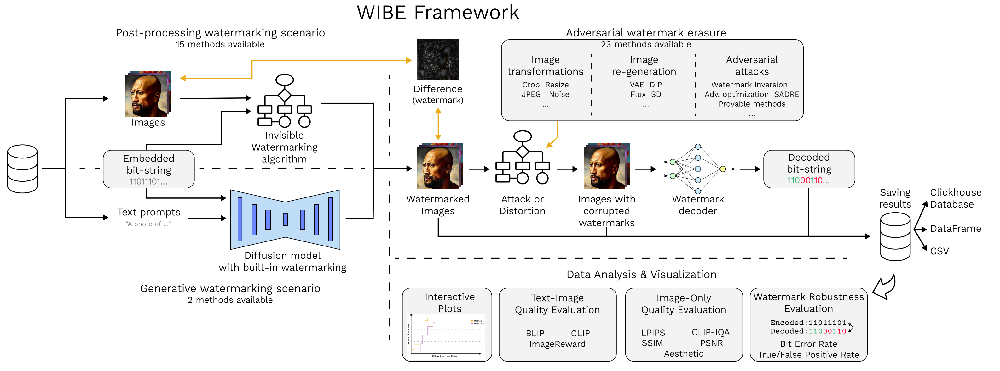
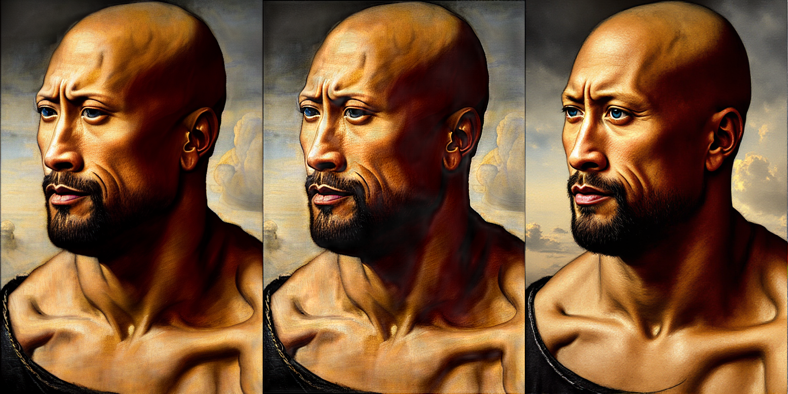
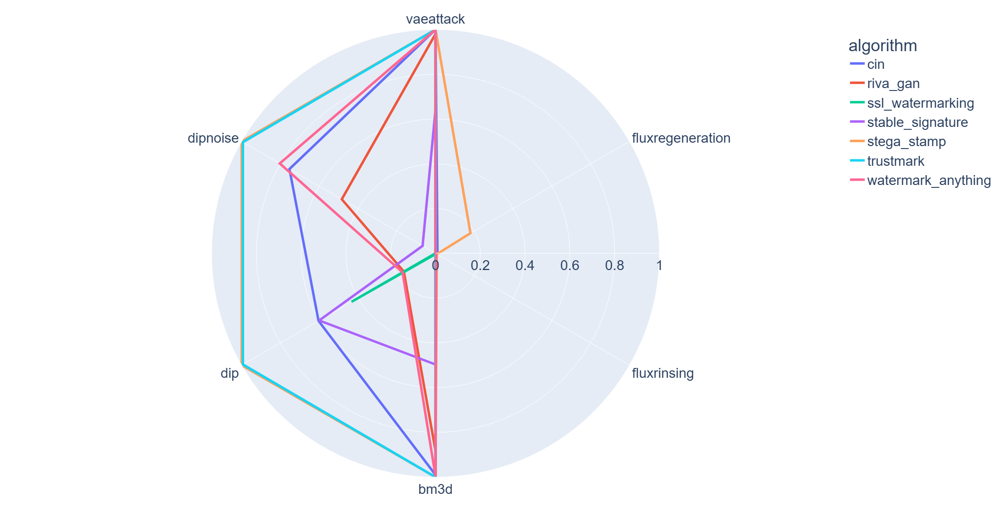

WIBE: Watermarks for generated Images – Benchmarking & Evaluation
=================================================================

.. image:: https://readthedocs.org/projects/example-sphinx-basic/badge/?version=latest
    :target: https://ispras-wibe.readthedocs.io/en/latest/?badge=latest
    :alt: Documentation Status

**WIBE** is a modular and extensible framework for automated testing of invisible image watermarking methods under various attack scenarios.
The system is designed to support research and development of robust watermarking techniques by enabling systematic evaluation
through a customizable processing pipeline.

The system architecture consists of a sequence of processing configurable stages.

Key features
------------

* Modularity and extensibility through a plugin-based architecture.
* Reproducibility ensured by YAML-configured experiments.
* Usability with a simple command-line interface.
* Flexible persistence through multiple storage backends, including files and ClickHouse database.
* Transparency via real-time visual feedback.
* Scalability to run experiments on clusters.

Quick start
-----------

To assess implemented watermarking algorithms and attacks on watermarks, follow the step-by-step procedure below.

1. Clone the repository and navigate to its directory (all subsequent commands should be run from this location):

.. code-block:: console

    git clone https://github.com/ispras/wibe.git

2. Update the submodules:

.. code-block:: console

    git submodule update --init --recursive

3. Create and activate a virtual environment (the exact command varies slightly between OSes – you know how to do this):

.. code-block:: console

    python -m venv venv

4. Download the pre-trained model weights:

.. code-block:: console

    (venv) python download_models.py

5. Install the dependencies:

.. code-block:: console

    (venv) python install_requirements.py

6. Set the **HF_TOKEN** environment variable with your **HuggingFace** `token <https://huggingface.co/settings/tokens>`_ (see `HuggingFace Authentication Setup <https://ispras-wibe.readthedocs.io/en/latest/quick_start.html#huggingface-authentication-setup>`_ for details), then authenticate:

.. code-block:: console

    (venv) python huggingface_login.py

7. All set! Specify the path to your ``сonfiguration file``  as a required parameter:

.. code-block:: console

    (venv) python -m wibench --config configs/demo.yml

8. Upon completion of computations, you can view watermarked images and explore interactive charts for different combinations of watermarking techniques, attacks, and computed performance metrics.

Below, from left to right, are the original, watermarked, and attacked images.

Below is a ``TPR@0.1%FPR`` chart for 7 algorithms under different types of attacks (evaluated on 300 images from the `DiffusionDB <https://poloclub.github.io/diffusiondb/>`_ dataset).

Documentation
-------------

See the full documentation `here <https://ispras-wibe.readthedocs.io/en/latest/index.html>`_.

Tutorial video
--------------

.. TODO: add link to youtube video
